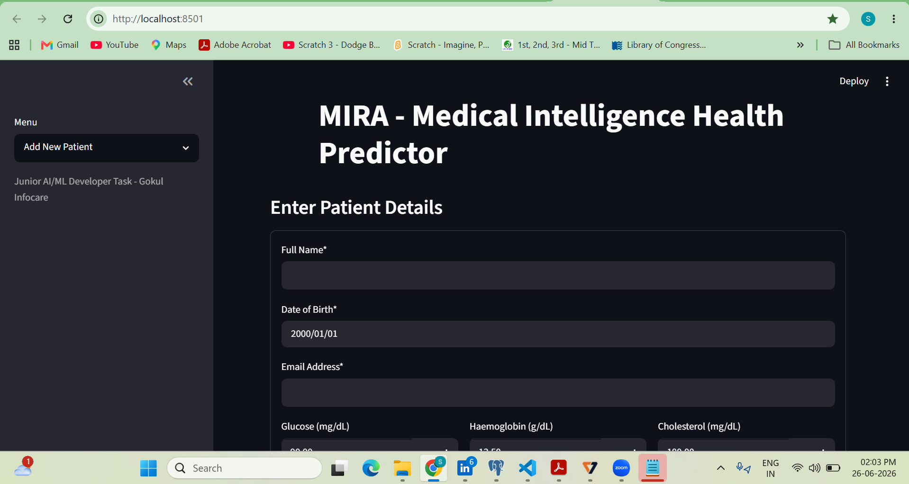
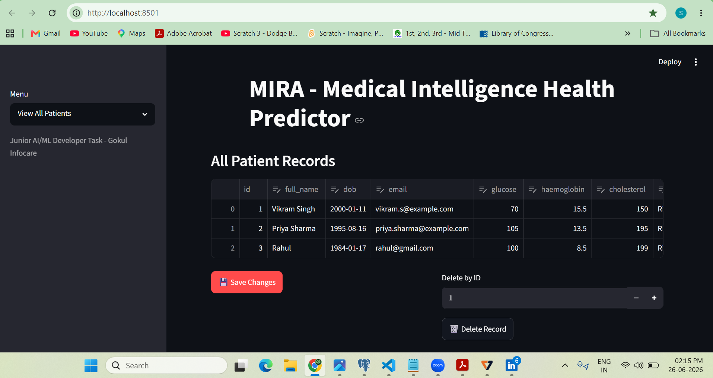
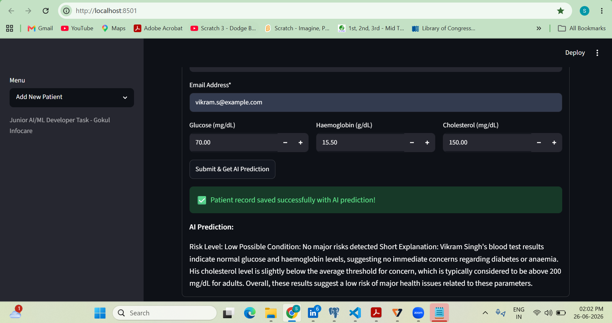
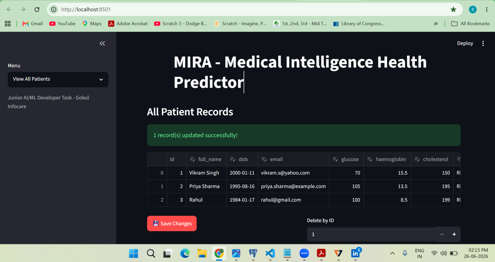
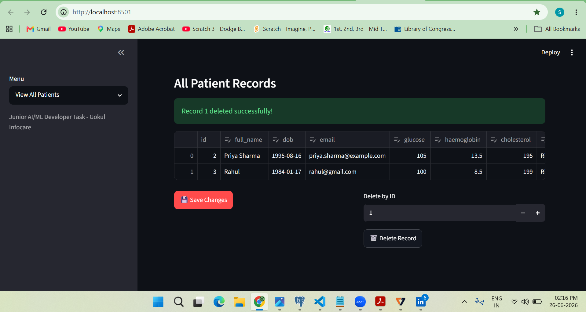
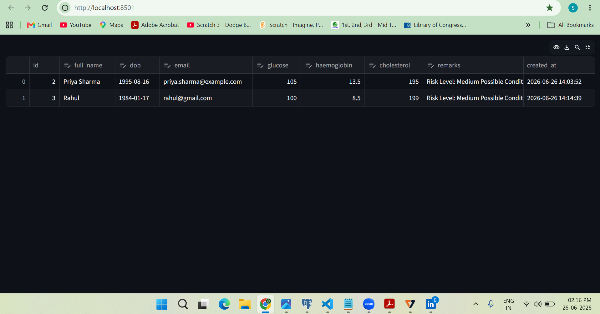

# 🩺 MIRA - Medical Intelligence Health Predictor

A **Streamlit-based healthcare application** developed as part of the **AI/ML Developer **.

The application enables users to manage patient records using full **CRUD (Create, Read, Update, Delete)** operations, store data in **PostgreSQL**, and generate **AI-powered health risk predictions** using the **Groq External API** with the **Llama 3.3 70B Versatile** model.

---

##  Features

- ✅ Create, Read, Update, and Delete (CRUD) patient records
- ✅ PostgreSQL database integration
- ✅ AI-powered health risk prediction using **Groq API**
- ✅ Structured AI-generated health risk assessment
- ✅ Input validation
  - Email validation
  - Date of Birth validation
  - Blood parameter validation
- ✅ Responsive Streamlit user interface
- ✅ Persistent data storage
- ✅ Inline editing and record deletion
- ✅ Error handling for database and API failures
- ✅ Environment variable management using `python-dotenv`

---

## 🛠 Tech Stack

| Component | Technology |
|-----------|------------|
| Frontend | Streamlit |
| Backend | Python |
| Database | PostgreSQL |
| Database Driver | psycopg2 |
| AI Service | Groq API |
| AI Model | `llama-3.3-70b-versatile` |
| Environment Variables | python-dotenv |

---

## 📂 Project Structure

```text
health-prediction-app/
│
├── app.py
├── requirements.txt
├── README.md
├── .env.example
├── .gitignore
└── images/
```

---

#  Installation

## 1. Clone the Repository

```bash
git clone https://github.com/<your-username>/health-prediction-app.git
cd health-prediction-app
```

---

## 2. Create a Virtual Environment

### Windows

```bash
python -m venv venv
venv\Scripts\activate
```

### Linux / macOS

```bash
python3 -m venv venv
source venv/bin/activate
```

---

## 3. Install Dependencies

```bash
pip install -r requirements.txt
```

Or install manually:

```bash
pip install streamlit pandas psycopg2-binary python-dotenv groq
```

---

## 4. Configure PostgreSQL

Create a PostgreSQL database named:

```text
health_db
```

---

## 5. Create a `.env` File

Create a `.env` file in the project root with the following contents:

```env
DB_HOST=localhost
DB_PORT=5432
DB_NAME=health_db
DB_USER=postgres
DB_PASSWORD=your_password

GROQ_API_KEY=your_groq_api_key
```

You can obtain a Groq API key from:

https://console.groq.com/keys

---

## 6. Run the Application

```bash
streamlit run app.py
```

Open your browser and navigate to:

```
http://localhost:8501
```

---

#  AI Integration

This project uses the **Groq External API** with the **Llama 3.3 70B Versatile** model to generate health risk predictions based on patient blood test parameters.

The AI returns a structured prediction containing:

- **Risk Level** (Low / Medium / High)
- **Possible Condition**
- **Short Explanation**

### Example Output

```text
Risk Level: Medium

Possible Condition: Prediabetes

Short Explanation:
The glucose level is mildly elevated while cholesterol and haemoglobin remain within acceptable ranges. These findings may indicate an increased risk of impaired glucose regulation.
```

---

# ✔ Validation

The application validates:

- Full Name (Required)
- Email format
- Date of Birth
- Glucose (0–500 mg/dL)
- Haemoglobin (5–20 g/dL)
- Cholesterol (100–400 mg/dL)

---

# 🗄 Database Schema

The application automatically creates the following table:

```sql
patients
```

Fields stored:

- ID
- Full Name
- Date of Birth
- Email
- Glucose
- Haemoglobin
- Cholesterol
- AI Prediction (Remarks)
- Created Timestamp

---

#  Error Handling

The application gracefully handles:

- Database connection failures
- Invalid user input
- Missing Groq API key
- External API errors
- CRUD operation failures

---

#  Screenshots

Add screenshots after uploading them to the `images` folder.

```text
images/home.png
images/patient-list.png
images/ai-prediction.png
images/patient-update-detail.png
images/patient-delete-detail.png
images/patient-view.png
```

Example:

```markdown













```

---


#  Future Improvements
=======

- User authentication
- Search and filter functionality
- Export records to CSV/PDF
- Health analytics dashboard
- Role-based access control
- Integration with additional healthcare APIs

---

#  Author

**Sindhiya Maria**

Submitted as part of the **Junior AI/ML Developer Technical Assessment**.
